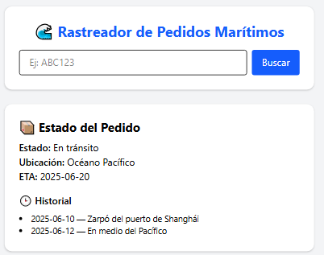

# Tracker

Este es un proyecto de prueba diseñado para simular un **sistema de rastreo de envíos**, enfocado en demostrar habilidades modernas con **React 18**, incluyendo:

- Manejo de formularios controlados
- `useTransition` para renders diferidos
- Simulación de fetch con datos mock
- Manejo de estados: loading, error y resultado
- TailwindCSS para diseño responsivo

---

## 📸 Vista previa

 <!-- Puedes colocar un screenshot si deseas -->

---

## 🚀 Tecnologías usadas

- [React 18](https://react.dev/)
- [TailwindCSS](https://tailwindcss.com/)
- [Vite](https://vitejs.dev/)
- [`useTransition`](https://react.dev/reference/react/useTransition)
- `TypeScript`

---

## 🧪 Funcionalidad principal

1. El usuario ingresa un **ID de envío** (ej. `ABC123` o `XYZ789`).
2. Al hacer clic en "Buscar", se simula una llamada a una API con retraso.
3. Durante la espera, se muestra un mensaje de **cargando...** usando `isPending`.
4. Al obtener resultados:
   - Se muestran el estado, ubicación, ETA y el historial.
5. Si no existe el ID, se muestra un mensaje de error.

---

## 📦 Datos simulados

El fetch es simulado con un objeto local:

```ts
const SHIPMENTS = {
  ABC123: { status: "En tránsito", ... },
  XYZ789: { status: "Entregado", ... }
};
